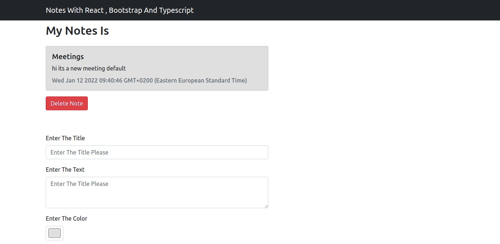

# Notes-Mini-App
this is a React Webpage for adding notes and removing them with typescript



## Live Link

- Live: [DEMO](https://mini-react-note-app.netlify.app/)

## Built with


- React
- TypeScript
- DOM properties and attributes
- Pure JavaScript
- HTML & Css

## Getting Started
To get a local copy of the repository please run the following commands on your terminal:
- ```$ cd <folder>```
- ```$ git clone https://github.com/medobarakat/Notes-App.git ```
- ```$ cd Notes-App ```
- ```npm install```
- ```npm start```


## Authors

👤 **Ahmed Barakat**
- Github: [@medobarakat](https://github.com/medobarakat)

- Linkedin: [Ahmed Barakat](https://www.linkedin.com/in/ahmed-barakat-dev/)

- Email: [My Gmail](ahmedbarakat2401@gmail.com)

##    Contributing

Contributions, issues and feature requests are welcome!

## Show your support

Give a ⭐️ if you like this project!

